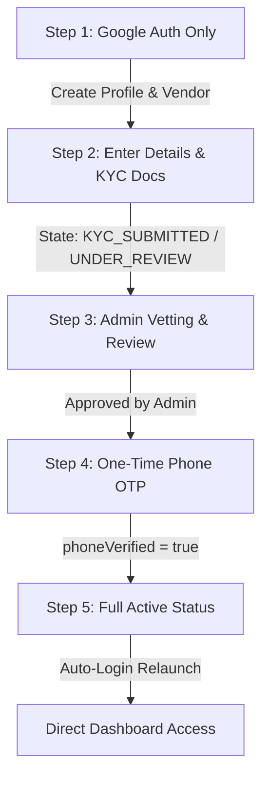

# 🛡️ Vantyrn Vendor Auth + KYC Workflow Architecture Blueprint

This document details the production-grade architectural redesign for the **Vantyrn Vendor Onboarding, KYC Persistence, and One-Time Authentication Workflow**. 

---

## 🗺️ Architectural Workflow Overview

The onboarding workflow flows in a strict sequential timeline to ensure absolute validation, security, and a premium user experience.

---

## 🔑 Lifecycle State Transitions

We coordinate two tables in our Prisma/PostgreSQL database to manage vendor lifecycles:
1.  **`Profile` Table:** Controls global routing and auth constraints (`profileStatus`).
2.  **`Vendor` Table:** Controls specific vendor operational permissions (`accountStatus` and `phoneVerified`).

### State Matrix

| Phase / State | `Profile.profileStatus` | `Vendor.accountStatus` | `Vendor.phoneVerified` | Client Access Permissions |
| :--- | :--- | :--- | :--- | :--- |
| **1. Google Auth Only** | `PENDING` | `PENDING` | `false` | Blocked (Redirect to Details Screen) |
| **2. Details/KYC Submitted** | `UNDER_REVIEW` | `KYC_SUBMITTED` | `false` | Blocked (Redirect to Status Vetting Screen) |
| **3. Admin Approved** | `APPROVED` | `APPROVED` | `false` | **Trigger Step 4: OTP Verification Screen** |
| **4. OTP Verified (Active)** | `APPROVED` | `ACTIVE` | `true` | **Full Operational Access** |
| **5. Admin Suspended** | `SUSPENDED` | `SUSPENDED` | `true`/`false` | Blocked (Redirect to Suspended Screen) |
| **6. Admin Temp Blocked** | `DISABLED:datetime`| `DISABLED` | `true`/`false` | Blocked (Redirect to Suspended Countdown Screen) |

---

## ⚡ Critical Engineering Analyses & Mitigation

### 1. Database Unique Constraint Conflict (`Profile.phoneNumber` & `Vendor.phone`)
*   **The Conflict:** In `schema.prisma`, both `Profile.phoneNumber` and `Vendor.phone` are marked `@unique` and are **non-nullable**. When a new vendor logs in with Google in **Step 1**, we have no verified phone number. Attempting to insert a blank or null value will throw a PostgreSQL constraint error.
*   **The Mitigation:** During Step 1, when creating the database profile, we generate a secure, unique placeholder phone number based on their Google UID (e.g., `+google-placeholder-${firebaseUid.substring(0, 10)}`).
*   **Resolution:** In **Step 2**, when they input their phone details, we save the real number to a temporary field or validate it. In **Step 4** (after OTP validation), we update `Profile.phoneNumber` and `Vendor.phone` to their actual verified number, removing the placeholder safely.

### 2. Firebase User-Linking Mismatch (Google vs. Phone Auth)
*   **The Conflict:** Tying multiple credentials directly inside Firebase (`user.linkWithCredential`) frequently fails if the user's phone number was previously registered on a customer account, throwing `auth/credential-already-in-use`.
*   **The Mitigation:** We separate authentication concerns:
    *   **Google Auth** remains the sole **Identity Provider** on Firebase. All auth tokens and logins pass through their Google credential.
    *   **Phone Verification** is handled purely as a verification action. The app requests a Firebase OTP to verify phone ownership. Once verified, it updates `phoneVerified = true` in our database under their SQL profile, bypassing the Firebase linking block completely while maintaining absolute security.

### 3. Session Persistence Parity
*   **Persistent Storage:** Session tokens, `profileStatus`, and `phoneVerified` status are stored securely inside React Native `AsyncStorage` under `auth_session`.
*   **Token Refresh Handshake:** On every API call, the client's request interceptor (`services/api.js`) dynamically queries the active Firebase Google account, grabs a refreshed ID token, and updates Zustand. This keeps vendors logged in indefinitely.
*   **Relaunch Verification:** During application launch, the root `_layout.js` retrieves `auth_session`, evaluates the current status, and instantly routes them to the correct dashboard, eliminating redundant login requests.

---

## 📋 Step-by-Step Implementation Walkthrough

### 🟩 STEP 1: GOOGLE AUTH ONLY
1.  Vendor taps **"Continue with Google"** on the Login Screen.
2.  Google Login succeeds. Firebase yields the Google `uid` and verified `email`.
3.  The client calls the `/auth/google-login` endpoint on the server.
4.  **Self-Healing Profile Alignment:**
    *   If the profile already exists, return the profile, `profileStatus`, and `phoneVerified` flag.
    *   If it is a new account, create `Profile` and `Vendor` records in PostgreSQL, using a unique `+google-placeholder-${uid}` phone value.
5.  Client receives the auth payload, sets Zustand `isAuthenticated = true`, and saves the session to `AsyncStorage`.

### 🟨 STEP 2: VENDOR DETAILS + KYC SUBMISSION
1.  If the client detects `profileStatus === 'PENDING'`, it automatically routes the vendor to the **KYC Details & Bank Registration Screen**.
2.  Vendor completes their form (Business details, PAN, Bank Details, and Phone Number) and uploads their compliance documents.
3.  The vendor submits the details. The server:
    *   Updates the `Vendor` business records.
    *   Transition `Profile.profileStatus` ➔ `UNDER_REVIEW`.
    *   Transition `Vendor.accountStatus` ➔ `KYC_SUBMITTED`.
4.  The client redirects the vendor to the **`/kyc/status` Screen** (which shows a premium vetting screen). The vendor is blocked from accessing the orders, menu, or earnings dashboards.

### 🟦 STEP 3: ADMIN KYC REVIEW
1.  Admin evaluates documents and details.
2.  **If Rejected:** Admin marks status `REJECTED`. The backend emits a socket event. The vendor screen updates, prompting them to re-edit and re-submit (no Google re-auth or phone OTP required!).
3.  **If Approved:** Admin marks status `APPROVED`. The backend updates both profiles.

### 🟧 STEP 4: ONE-TIME PHONE OTP AFTER APPROVAL
1.  Once `profileStatus` becomes `APPROVED`, the client checks if `Vendor.phoneVerified` is `false`.
2.  If `false`, the client redirects the vendor to the **One-Time Phone Verification Screen**.
3.  The vendor requests an OTP to the phone number they provided in Step 2.
4.  Vendor enters the OTP, and the app verifies it.
5.  Upon successful verification, the client calls `/auth/verify-phone-payout`. The server:
    *   Updates `Profile.phoneNumber` and `Vendor.phone` from the placeholder to their actual real phone number in the SQL database.
    *   Updates `Vendor.phoneVerified = true`.
    *   Updates `Vendor.accountStatus` ➔ `ACTIVE`.
6.  The client updates Zustand and AsyncStorage, and routes them to the main vendor dashboard!

### 🟩 STEP 5: ONGOING PERSISTENCE RULES
*   **KYC Edit Flow:** If the vendor edits their details later, they submit the form. The system updates the records and maintains `phoneVerified = true`. **No OTP is requested again.**
*   **Phone Number Change:** If the vendor explicitly changes their phone number in their settings:
    *   Set `phoneVerified = false`.
    *   Force them to complete OTP verification for the new number before returning to active operational status.
*   **Manual Logout / Session Expiry:** Only standard logout clears the `AsyncStorage` and requests a Google Login upon next launch.

---

## 🔒 Security Rule Implicatures & API Borders

1.  **Endpoint Guards:**
    *   All protected operational routes (Orders, Menu, Earnings) check `requireKyc` middleware.
    *   The middleware strictly blocks requests if `profileStatus !== 'APPROVED'` OR `phoneVerified !== true`.
2.  **Google-only Auth Token Boundary:**
    *   All API requests require the Google Firebase ID token. The phone number is verified as a transactional payload rather than an authentication provider, preventing cross-profile mapping leaks.
